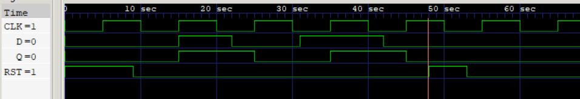

### Timeline breakdown

Let’s walk:

* **t=0**

  * `CLK=0`, `RST=1`, `D=0`, `Q=0`.
    Reset is active, so Q=0.

* **t=5**

  * `CLK=1`, `RST=1`, `D=0`.
    Still reset → Q stays 0.

* **t=9**

  * `RST=0`.
    Reset deasserted.

* **t=10**

  * `CLK=0`.
    No edge yet.

* **t=15**

  * `CLK=1`, `D=1`.
    Rising edge! Since reset is 0, Q captures D → Q=1.

* **t=20–22**

  * `D` drops to 0, but no rising edge yet → Q still 1.

* **t=25**

  * Rising edge of CLK. `D=0` → Q becomes 0.

* **t=31, 35**

  * D goes 1, rising edge at t=35 → Q=1.

* **t=42**

  * D=0, no clock edge yet.

* **t=45**

  * Rising edge, so Q=0.

* **t=48**

  * Reset asserted again (`RST=1`).
    Q is forced to 0 immediately.

* **t=53**

  * Reset released (`RST=0`).

* **t=55**

  * Rising edge. If D was 0, Q=0.

* **t=65**

  * Rising edge again, check D at that moment. (If still 0, Q stays 0).

